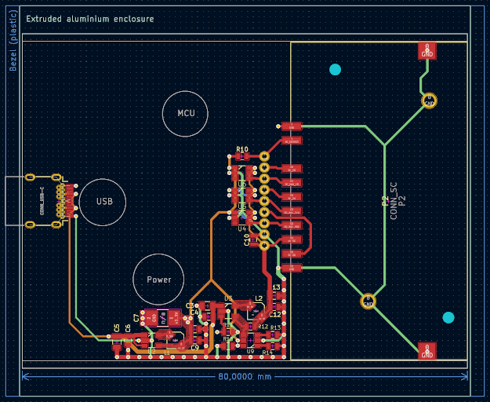

Cowkeyr Smartcard G0
====================

Cowkeyr is a family of security and access control tools. The goal of SC-G0
project is to design a smartcard reader with an opensource and auditable
firmware.

